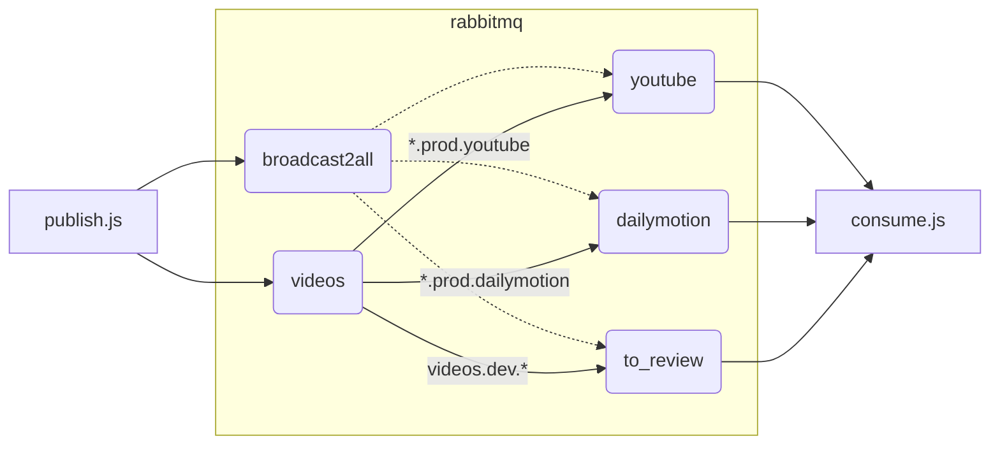
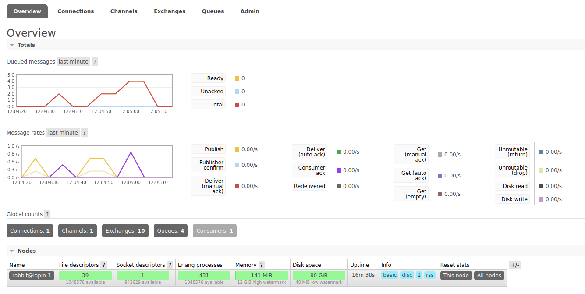
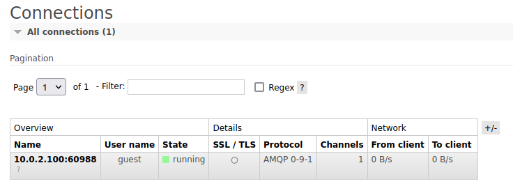
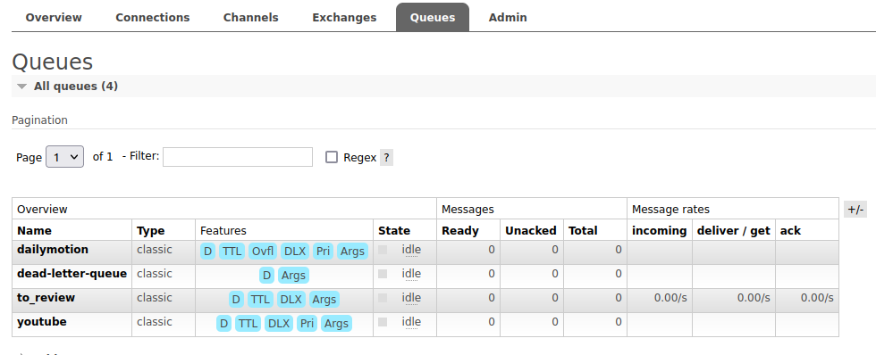
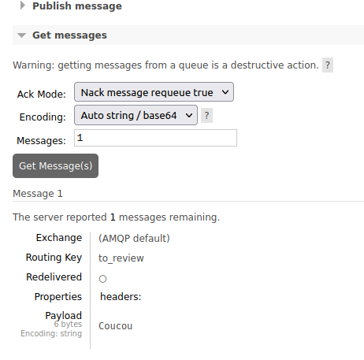
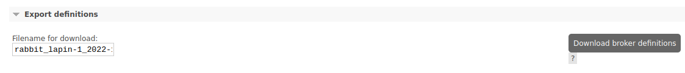

# Utilisation d'un rabbitmq simple avec docker

Le but de ce dépôt est la mise à disposition d'une image docker simple Rabbitmq, avec le plugin de management et des exemples d'utilisation en javascript.
L'image fournie est à des fins de POC/dev uniquement, des informatiosn supplémentaires sont fournies pour un passage en prod.

## Prérequis

### Container runtime - podman

La plupart des exemples et docs utilisent le client `docker`, mais nous lui préfèrerons le client [podman](https://podman.io/), plus moderne et plus sécurisé que docker.
Il est à l'origine développé par Redhat pour être utilisé dans le toolkit développeur pour Openshift, mais peut tout à fait être utilisé indépendamment en remplacement à l'identique de docker pour la majorité des commandes: `podman pull ...`, `podman images`, `podman run ...`, `podman ps -a` ...

Si vous préférrez utiliser docker, toutes les commandes utilisées peuvent simplement être traduites de `podman cmd` vers `docker cmd` avec les mêmes arguments.

### Librairie amqplib pour javascript

On se base ici sur la librairie [amqplib](https://github.com/amqp-node/amqplib) utilisée par le client amqp.node de Nodejs, donc la doc est disponible [ici](https://amqp-node.github.io/amqplib/).:

```bash
npm install amqplib
```

## Quickstart

On peut simplement récupérer et lancer l'image pour faire tourner le broker Rabbitmq configuré, puis utiliser les scripts `send.js` et `receive.js` pour écrire et lire des messages dans le broker :

[](https://asciinema.org/a/531191)


## Utilisation de l'image all-in-one

### Rappel de la terminologie Rabbitmq

* Le **producer** est un émetteur de messages qu'il publie dans un **exchange**
* Une **queue** est une file où sont stockés les messages en attente d'être consommés
* Le passage de l'*exchange* à la *queue* se fait via le **Binding**, en définissant des *routing keys*.
* Le **consumer** est celui qui va lire les messages dans une queue

> Les bases du protocol AMQP: https://www.rabbitmq.com/tutorials/amqp-concepts.html

### Configuration du Rabbitmq

L'image docker construite à partir du dockerfile de ce dépôt embarque une configuration pré-définie comportant deux publishers, trois queues et les bindings associés :



On peut publier sur :

* broadcast2all qui envoie à toutes les queues
* videos qui fait du routage par clé
* (directement sur une queue par son nom)

Une queue `dead-letter-queue` est configurée pour récupérer les messages **nok** ou ayant dépassé le TTL configuré.

### Récupération de l'image

L'image peut être construite en locale :

```bash
podman build -t rabbitmq-docker-simple:v1.0 .
```

Ou récupérée sur le [dockerhub](https://hub.docker.com/repository/docker/abrxd/rabbitmq-docker-simple/general) :

```bash
podman pull docker.io/abrxd/rabbitmq-docker-simple:v1.0
```

### Lancement du broker

Pour instancier l'image :

```bash
podman run -d --hostname lapin-1 --name clapier-1 -p 15672:15672 -p 5672:5672 abrxd/rabbitmq-docker-simple:v1.0
```

L'IHM d'administration est joignable à `http://localhost:15672` avec l'utilisateur `guest:guest`

A noter que :

* le nom `clapier-1` correspond au nom du container
* le hostname `lapin-1` correspond au nom du node Rabbitmq
* on expose l'IHM de management sur le port 15672, on peut s'y connecter sur `http://localhost:15672` avec l'utilisateur `guest:guest`
* Le port 5672 sert aux envois/réception avec le protocole AMQP

### Publier et consommer des messages en javascript

Les scripts `send.js` et `receive.js` montrent comment utiliser simplement la librairie amqplib pour publier ou recevoir des messages dans le broker.


NB: La majorité des éléments présentés ici sont adaptés des [tutoriels](https://www.rabbitmq.com/getstarted.html) fournis en opensource par Rabbitmq, que je vous invite à consulter pour ajouter notamment :

* la [parallélisation](https://www.rabbitmq.com/tutorials/tutorial-two-javascript.html)
* l'[abonnement](https://www.rabbitmq.com/tutorials/tutorial-five-javascript.html) à un type de message en particulier
* la gestion des [priorités](https://www.rabbitmq.com/tutorials/tutorial-four-javascript.html)
* l'utilisation de [Remote Procedure Call ](https://www.rabbitmq.com/tutorials/tutorial-six-javascript.html) (RPC)


## Utiliser l'IHM de management

En se connectant sur `http://localhost:15672` avec l'utilisateur `guest:guest` on peut avoir un overview des messages publiés et consommés:



On peut voir la liste des connexions actives:



Des exchanges et des queues sur lesquels on peut publier : 




Ou publier et récupérer des images à la main pour tester (attention la récupération est comme un `pop()`, elle consomme le message)



Par contre les modifications faites à la main ne survivront pas à la suppression du container, on peut exporter la définition facilement via la vue overview:



Puis si on veut la persister, mettre à jour le fichier `config/definitions.json` et reconstruire l'image:

```bash
podman build -t rabbitmq-docker-simple:v1.0 .
```

## Pour aller plus loin

Voici quelques sujets qui sont détaillés séparémment :

* La [sécurisation de l'image](docs/security.md) via un outil de scan d'image
* La [TODOLIST](docs/production-todo.md) avant passage en production
* Comment [mettre à jour](docs/upgrade.md) l'image de test
* Comment [utiliser l'image officielle Rabbitmq](docs/image-officielle.md), utilisée pour construire celle fournie ici

