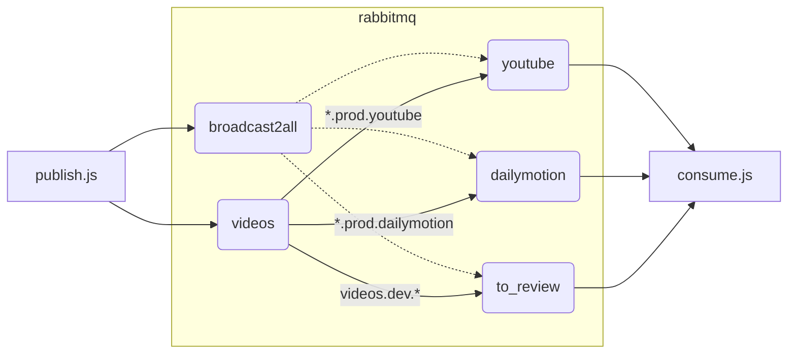

# Utilisation d'un rabbitmq simple avec docker

Le but de ce dépôt est la mise à disposition d'une image docker simple Rabbitmq, avec le plugin de management et des exemples d'utilisation en javascript.

## Note sur le runtime utilisé

La plupart des exemples et docs utilisent le client `docker`, mais nous lui préfèrerons le client [podman](https://podman.io/), plus moderne et plus sécurisé que docker.
Il est à l'origine développé par Redhat pour être utilisé dans le toolkit développeur pour Openshift, mais peut tout à fait être utilisé indépendamment en remplacement à l'identique de docker pour la majorité des commandes:

```
podman pull ...
podman images
podman run ...
podman ps -a
```

Si vous préférrez utiliser docker, toutes les commandes utilisées peuvent simplement être traduites de `podman cmd` vers `docker cmd` avec les mêmes arguments.

## Utilisation de l'image all-in-one

L'image docker construite à partir du dockerfile de ce dépôt embarque une configuration pré-définie comportant deux publishers, trois queues et les bindings associés :



Elle peut être construite en locale :

```bash
podman build -t rabbitmq-docker-simple:v1.0 .
```

Ou récupérée sur le [dockerhub](https://hub.docker.com/repository/docker/abrxd/rabbitmq-docker-simple/general) :

```bash
podman pull abrxd/rabbitmq-docker-simple:v1.0
```

Pour l'exécuter :

```bash
podman run -d --hostname lapin-1 --name clapier-1 -p 8080:15672 abrxd/rabbitmq-docker-simple:v1.0
```

L'IHM d'administration est joignable à `http://localhost:8080` avec l'utilisateur `guest:guest`

## Utilisation de l'image officielle Rabbitmq

L'image de base utilisée est l'[image Rabbitmq officielle](https://hub.docker.com/_/rabbitmq) présente sur le docker hub.

* On utilise la version de base et non la version alpine, comme préconisé pour la PROD
* On utilise les tags `*-management` qui incluent le plugin management activé par défaut
* On ne sélectionne que les tags présentant a minima la version mineure utilisée: `3.11.2-management` (il manque la version OS pour être parfait)

Pour instancier simplement l'image officielle :

```bash
podman pull rabbitmq:3.11.2-management
podman run -d --hostname lapin-1 --name clapier-1 -p 8080:15672 rabbitmq:3.11.2-management
```

A noter que :

* le nom `clapier-1` correspond au nom du container
* le hostname `lapin-1` correspond au nom du node Rabbitmq
* on expose l'IHM de management sur le port 8080 (le container expose le 15672), on peut s'y connecter sur `http://localhost:8080` avec l'utilisateur `guest:guest`

Le détail pour publier et consommer des messages en javascript est détaillé dans la [section dédiée](docs/javascript-connector.md). 


## Focus

Voici quelques sujets qui sont détaillés séparémment :

* La [sécurisation de l'image](docs/security.md) via un outil de scan d'image
* La [TODOLIST](docs/production-todo.md) avant passage en production
* Comment [mettre à jour](docs/upgrade.md) l'image de test
